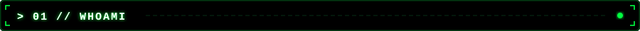
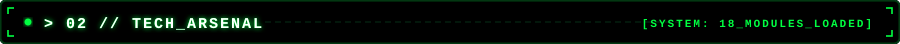
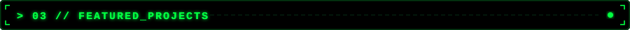
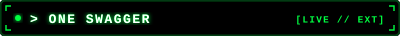
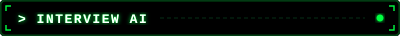
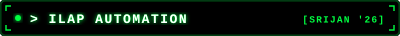
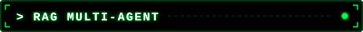
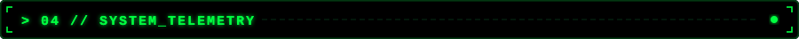
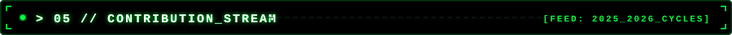

<div align="center">

<!-- MATRIX DIGITAL RAIN ANIMATED HEADER -->


<br/>

<!-- MATRIX TYPING ANIMATION -->
<a href="https://git.io/typing-svg">
  
</a>

<br/><br/>

<!-- MATRIX THEMED TELEMETRY BADGES -->
<p>
  
  &nbsp;&nbsp;
  <a href="https://github.com/anikethana21?tab=followers">
    
  </a>
  &nbsp;&nbsp;
  <a href="https://github.com/anikethana21?tab=repositories&sort=stargazers">
    
  </a>
</p>

</div>

<!-- MATRIX LASER DIVIDER -->
<div align="center">
  
</div>

<br/>

<!-- SECTION 01: WHOAMI -->
<div align="center">
  
</div>

<br/>

```typescript
const aniketh = {
  identity: "Anikethana",
  location: "Bengaluru, India",
  currentAssignment: "Software Engineering Intern @ My Startup Wave",
  designations: ["Full-Stack Engineer", "GenAI Architect", "DevTools Creator"],
  coreStack: ["Next.js 15", "React 19", "TypeScript", "FastAPI", "Python"],
  aiArsenal: ["Gemini 2.0 Flash", "Google Stitch", "Agentic Workflows", "Figma"],
  activeOps: "GenAI pipelines, Multi-Agent workflows & scalable web apps",
  directive: "Wake up, Neo... The Matrix has you 🐇"
};
```

- 💼 **Software Engineering Intern** at **[My Startup Wave](https://mystartupwave.com/)** — engineering modern web & AI solutions
- 🔭 Developing **GenAI-powered applications** & Multi-Agent systems with **Gemini 2.0 Flash** & **Next.js 15**
- 🎨 AI-assisted UI/UX design & rapid prototyping with **Google Stitch** & **Figma**
- 🛠️ Creator of **One Swagger** — live on [VS Code Marketplace](https://marketplace.visualstudio.com/) & Chrome Web Store
- 🏆 **National Finalist** @ SRIJAN 2026 | Smart India Hackathon contributor
- 💬 Ask me about **Next.js, React 19, FastAPI, GenAI, Google Stitch, Extension Development**
- 📫 Reach me at **anikethana2109@gmail.com**

<br/>

<!-- MATRIX LASER DIVIDER -->
<div align="center">
  
</div>

<br/>

<!-- SECTION 02: TECH ARSENAL -->
<div align="center">
  
</div>

<br/>

<div align="center">

<table>
<tr>
<td align="center" width="110">
  
  <br><strong>Next.js</strong>
</td>
<td align="center" width="110">
  
  <br><strong>React 19</strong>
</td>
<td align="center" width="110">
  
  <br><strong>TypeScript</strong>
</td>
<td align="center" width="110">
  
  <br><strong>JavaScript</strong>
</td>
<td align="center" width="110">
  
  <br><strong>Python</strong>
</td>
<td align="center" width="110">
  
  <br><strong>Tailwind</strong>
</td>
</tr>
<tr>
<td align="center" width="110">
  
  <br><strong>Node.js</strong>
</td>
<td align="center" width="110">
  
  <br><strong>Express</strong>
</td>
<td align="center" width="110">
  
  <br><strong>FastAPI</strong>
</td>
<td align="center" width="110">
  
  <br><strong>MongoDB</strong>
</td>
<td align="center" width="110">
  
  <br><strong>PostgreSQL</strong>
</td>
<td align="center" width="110">
  
  <br><strong>Vite</strong>
</td>
</tr>
<tr>
<td align="center" width="110">
  
  <br><strong>VS Code</strong>
</td>
<td align="center" width="110">
  
  <br><strong>Git</strong>
</td>
<td align="center" width="110">
  
  <br><strong>Docker</strong>
</td>
<td align="center" width="110">
  
  <br><strong>Figma</strong>
</td>
<td align="center" width="110">
  
  <br><strong>Gemini AI</strong>
</td>
<td align="center" width="110">
  
  <br><strong>Google Stitch</strong>
</td>
</tr>
</table>

</div>

<br/>

<!-- MATRIX LASER DIVIDER -->
<div align="center">
  
</div>

<br/>

<!-- SECTION 03: FEATURED PROJECTS -->
<div align="center">
  
</div>

<br/>

<div align="center">
<table width="100%">
<tr>
<td width="50%" valign="top">



> Universal OpenAPI testing tool with **zero-CORS proxy** architecture  
> Deployed across **Web App, Chrome Extension, and VS Code Marketplace**  


</td>
<td width="50%" valign="top">



> GenAI mock interview platform powered by **Gemini 2.0 Flash**  
> Schema-enforced Zod outputs and ATS-grade PDF report generation  


</td>
</tr>
<tr>
<td width="50%" valign="top">



> Automated Joiner-Mover-Leaver platform with conversational RBAC  
> **SRIJAN 2026 National Finalist** 🏆  


</td>
<td width="50%" valign="top">



> Autonomous multi-agent intelligence for real-time deep research  
> Browse the source at [repositories](https://github.com/anikethana21?tab=repositories) →  


</td>
</tr>
</table>
</div>

<br/>

<!-- MATRIX LASER DIVIDER -->
<div align="center">
  
</div>

<br/>

<!-- SECTION 04: MATRIX TELEMETRY -->
<div align="center">
  
</div>

<br/>

<div align="center">


<br/><br/>


</div>

<br/>

<!-- MATRIX LASER DIVIDER -->
<div align="center">
  
</div>

<br/>

<!-- SECTION 05: CONTRIBUTION STREAM -->
<div align="center">
  
</div>

<br/>

<div align="center">
  <picture>
    <source media="(prefers-color-scheme: dark)" srcset="./assets/github-snake-dark.svg" />
    <source media="(prefers-color-scheme: light)" srcset="./assets/github-snake.svg" />
    
  </picture>
</div>

<br/>

<!-- MATRIX LASER DIVIDER -->
<div align="center">
  
</div>

<br/>

<!-- SECTION 06: ESTABLISH UPLINK -->
<div align="center">
  
</div>

<br/>

<div align="center">

<a href="https://linkedin.com/in/anikethana21" target="_blank">
  
</a>
&nbsp;
<a href="mailto:anikethana2109@gmail.com">
  
</a>
&nbsp;
<a href="https://github.com/anikethana21" target="_blank">
  
</a>

<br/><br/>

*"There's a difference between knowing the path and walking the path." — Morpheus*

</div>

<br/>

<!-- MATRIX GREEN WAVING FOOTER -->
<div align="center">
  
</div>
