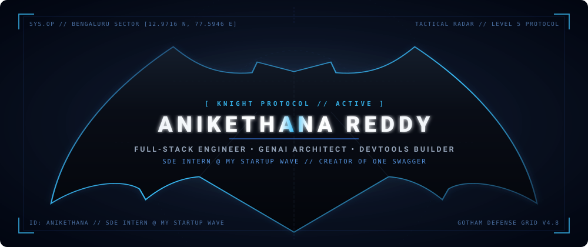

<div align="center">

<!-- MINIMAL BAT HEADER -->


<br/>

<!-- TYPING ANIMATION -->
<a href="https://git.io/typing-svg">
  
</a>

<br/><br/>


&nbsp;&nbsp;
<a href="https://github.com/anikethana21?tab=followers">
  
</a>
&nbsp;&nbsp;
<a href="https://github.com/anikethana21?tab=repositories&sort=stargazers">
  
</a>

</div>

<!-- THE SINGLE SIGNATURE BATARANG DIVIDER -->
<div align="center">
  
</div>

## About

```typescript
const operative = {
  identity: "Anikethana J L",
  base: "Bengaluru, India",
  currentAssignment: "Software Engineering Intern @ My Startup Wave",
  designations: ["Full-Stack Engineer", "GenAI Architect", "DevTools Builder"],
  coreStack: ["Next.js 15", "React 19", "TypeScript", "FastAPI", "Python"],
  aiArsenal: ["Gemini 2.0 Flash", "Google Stitch", "Agentic Workflows", "Figma"],
  activeOps: "GenAI pipelines, Multi-Agent workflows, production-grade web apps",
  protocol: "Ship fast. Ship clean. Never stop."
};
```

- **Software Engineering Intern** at **[My Startup Wave](https://mystartupwave.com/)** -- building modern web and AI solutions at scale
- Developing **GenAI-powered applications** and Multi-Agent systems with Gemini 2.0 and Next.js
- AI-assisted UI/UX design and rapid prototyping with **Google Stitch** and **Figma**
- Creator of **One Swagger** -- live on [VS Code Marketplace](https://marketplace.visualstudio.com/) + Chrome Web Store
- **National Finalist** at SRIJAN 2026 | Smart India Hackathon contributor
- Reach me at **anikethana2109@gmail.com**

---

## Tech Stack

<div align="center">

<table>
<tr>
<td align="center" width="110">
  
  <br><strong>Next.js</strong>
</td>
<td align="center" width="110">
  
  <br><strong>React 19</strong>
</td>
<td align="center" width="110">
  
  <br><strong>TypeScript</strong>
</td>
<td align="center" width="110">
  
  <br><strong>JavaScript</strong>
</td>
<td align="center" width="110">
  
  <br><strong>Python</strong>
</td>
<td align="center" width="110">
  
  <br><strong>Tailwind</strong>
</td>
</tr>
<tr>
<td align="center" width="110">
  
  <br><strong>Node.js</strong>
</td>
<td align="center" width="110">
  
  <br><strong>Express</strong>
</td>
<td align="center" width="110">
  
  <br><strong>FastAPI</strong>
</td>
<td align="center" width="110">
  
  <br><strong>MongoDB</strong>
</td>
<td align="center" width="110">
  
  <br><strong>PostgreSQL</strong>
</td>
<td align="center" width="110">
  
  <br><strong>Vite</strong>
</td>
</tr>
<tr>
<td align="center" width="110">
  
  <br><strong>VS Code</strong>
</td>
<td align="center" width="110">
  
  <br><strong>Git</strong>
</td>
<td align="center" width="110">
  
  <br><strong>Docker</strong>
</td>
<td align="center" width="110">
  
  <br><strong>Figma</strong>
</td>
<td align="center" width="110">
  
  <br><strong>Gemini AI</strong>
</td>
<td align="center" width="110">
  
  <br><strong>Google Stitch</strong>
</td>
</tr>
</table>

</div>

---

## Featured Projects

<div align="center">
<table>
<tr>
<td width="50%">

### One Swagger
> Universal OpenAPI testing tool with **zero-CORS proxy** architecture  
> Deployed across **Web App, Chrome Extension, and VS Code Marketplace**  
> `React 19` `FastAPI` `TypeScript` `Manifest V3`

</td>
<td width="50%">

### Interview AI
> GenAI mock interview platform powered by **Gemini 2.0 Flash**  
> Schema-enforced Zod outputs and ATS-grade PDF report generation  
> `React 19` `Express 5` `Gemini 2.0` `MongoDB`

</td>
</tr>
<tr>
<td width="50%">

### ILAP -- IAM Automation
> Automated Joiner-Mover-Leaver platform with conversational RBAC  
> **SRIJAN 2026 National Finalist**  
> `Python` `Security` `IAM` `SOC2`

</td>
<td width="50%">

### RAG Multi-Agent Systems
> Autonomous multi-agent intelligence for real-time deep research  
> Browse the source at [repositories](https://github.com/anikethana21?tab=repositories)  
> `Python` `LangGraph` `Gemini` `Vector DB`

</td>
</tr>
</table>
</div>

---

## Diagnostics

<div align="center">


<br/><br/>


</div>

---

## Patrol Grid

<div align="center">
  <picture>
    <source media="(prefers-color-scheme: dark)" srcset="./assets/github-snake-dark.svg" />
    <source media="(prefers-color-scheme: light)" srcset="./assets/github-snake.svg" />
    
  </picture>
</div>

---

## Connect

<div align="center">

<a href="https://linkedin.com/in/anikethana21" target="_blank">
  
</a>
&nbsp;
<a href="mailto:anikethana2109@gmail.com">
  
</a>
&nbsp;
<a href="https://github.com/anikethana21" target="_blank">
  
</a>

<br/><br/>

*"It's not who I am underneath, but what I do that defines me."*

</div>
